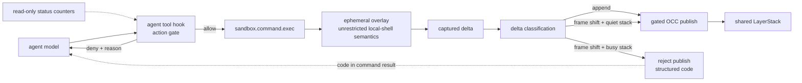
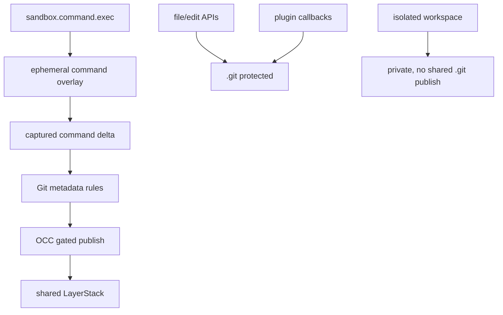

# Command Git Metadata OCC Rules

## Purpose

Define the architecture rules for Git metadata changes produced by
`sandbox.command.exec`.

Agents must be able to use normal Git commands from the command surface:
`git add`, `git commit`, `git commit --amend`, clean `git revert`, clean
`git cherry-pick`, clean squash commits, and clean completed rebase/squash
flows. These workflows are valid when the final repository state is complete and
healthy.

The architecture does not make `.git` generally mutable. It creates one narrow
rule set: command-produced Git metadata may publish through OCC only when it is
non-destructive, complete, conflict-checked, and — for history-frame changes —
published into a quiet stack.

This spec also defines the two-layer guard model around the command surface:
an agent-side tool hook that gates which actions may be attempted, and the OCC
merge gate that decides which observed results may become shared state. The two
layers are loosely coupled and independently correct.

## Two-Layer Guard Model

The sandbox never infers command intent. The agent runtime never sees published
deltas. Each layer guards the question it can actually answer:

- The agent tool hook guards **what an action may attempt right now**.
- OCC guards **what an observed delta may merge into shared state**.

| | Agent tool hook (action gate) | OCC publish (merge gate) |
| --- | --- | --- |
| Owns | Whether a command may be attempted now. | Whether an observed delta may become shared state. |
| Judges from | Command text, exact agent-side concurrency facts, cached sandbox status snapshot. | Captured delta, base manifest, live stack state at publish time. |
| Never sees | The resulting delta. | Command text, agent topology, or intent. |
| On violation | Deny before execution, with a model-readable reason. | Reject the whole publish; the overlay is discarded. |
| Authority | Advisory and bypassable by design. | Authoritative safety floor. |

Disagreement between the two layers is benign in both directions:

| Disagreement | Outcome | Severity |
| --- | --- | --- |
| Hook allows, OCC rejects. | Command ran; publish dropped with a coded reason. | Wasted work only; never corruption. |
| Hook denies, OCC would have accepted. | Command never ran. | Invisible capability loss; no downstream corrector exists, so this direction is measured deliberately (shadow mode, shared corpus). |

### Coupling Contract

Exactly two artifacts are shared between the layers; everything else may evolve
independently:

1. A closed set of structured rejection codes on the publish path
   (output-side contract; how the model learns why a publish dropped).
2. A shared command corpus used as a test fixture on both sides
   (CI-time alignment; never consulted at runtime).

Explicit non-contracts:

- No daemon-side admission step. Commands are never inspected, classified, or
  blocked on the way in.
- No policy metadata rides the command request. `sandbox.command.exec` input
  stays shell-like: the command itself plus execution controls such as
  `timeout_seconds` and `yield_time_ms`.
- The daemon accepts commands whether or not any agent hook exists. Clients
  without a hook fall back to the OCC floor alone.

## Architecture Boundary

The command surface is the only shared publish source that may carry `.git`
metadata. Direct file/edit APIs, plugin callbacks, and isolated workspaces do not
gain a general `.git` write capability.

## Core Invariants

1. `.git` is repository state, not ordinary workspace content.
2. Command Git metadata is allowed only when the final repository is healthy.
3. Destructive Git metadata changes are forbidden.
4. All accepted `.git` changes publish through OCC as gated paths.
5. `.gitignore` never makes `.git` direct or ungated.
6. A command publishes normal files and Git metadata atomically.
7. A rejected command publishes nothing; rollback is the discarded overlay.
8. Half-completed Git operations are not durable shared state.
9. OCC classifies observed deltas only; it never parses command text or infers
   intent.
10. Silent drops are reserved for provably no-op state; every other refusal is
    a loud rejection with a structured code.
11. History-frame changes merge only into a quiet stack; append-only Git
    changes merge unconditionally.

## Source Policy

| Source | `.git` rule |
| --- | --- |
| `sandbox.command.exec` in ephemeral mode | May publish validated `.git` metadata through gated OCC. |
| `sandbox.file.write` and `sandbox.file.edit` | Must reject or drop `.git` paths. |
| Plugin OCC callbacks | Must reject or drop `.git` paths unless a future explicit plugin contract opts in. |
| Isolated workspace commands | Keep `.git` changes private; do not publish to the shared LayerStack. |
| `sandbox.checkpoint.commit_to_git` | Separate operator checkpoint path; not the command Git architecture. |

## Ignore Rule Architecture

OCC routing has an ignore-rule lane for ordinary non-Git workspace paths. That
lane is based on `.gitignore` pattern semantics, but it is not based on Git
repository state.

| Question | Rule |
| --- | --- |
| Are nested `.gitignore` files considered? | Yes. `.gitignore` files under workspace subdirectories apply to their own subtree. |
| Are `.gitignore` files from newer LayerStack layers considered? | Yes. The active merged LayerStack view is the source of truth. |
| Does OCC shell out to `git check-ignore`? | No. OCC routing must not depend on a Git subprocess. |
| Does OCC use the Git index, tracked/untracked state, or `git status`? | No. OCC routing is independent of Git repository state. |
| Does OCC use `.gitignore` syntax? | Yes. The route oracle uses `.gitignore` pattern semantics for non-`.git` paths. |
| Can `.gitignore` affect `.git` metadata? | No. `.git` metadata is handled by the Git metadata rules before ordinary ignore routing. |

The architecture is therefore a LayerStack-aware ignore oracle: it reads
`.gitignore` content from the active LayerStack view, including ancestor and
nested subtree rules, and applies those rules without invoking Git. This preserves
Git-compatible ignore behavior for generated/cache paths while keeping OCC
independent from local checkout state and Git index state.

## Git Delta Classes

Every accepted command delta is classified from observed state only — the
captured delta plus the base manifest. There are no caller declarations.

| Class | Observable definition | Merge rule |
| --- | --- | --- |
| Append | New objects; fast-forward ref updates; HEAD symbolic target unchanged, or changed to a new ref that resolves to the same commit (a relabel, such as `git checkout -b`); clean index; reflog appends. | Merges under normal gated OCC, regardless of stack business. |
| Frame shift | HEAD symbolic-target change (branch switch or detach), or any non-fast-forward ref move (amend, reset, completed rebase). | Merges only into a quiet stack; otherwise the whole publish is rejected with a frame-shift code. |

Classification rules:

- A ref move is fast-forward when the old tip is an ancestor of the new tip.
  The ancestry check is bounded; an exhausted walk classifies conservatively as
  frame shift.
- Path-granular conflict checking cannot represent "everything else now means
  something different." The frame-shift class exists to make that one global
  property visible to the merge policy.

### Quiet-Stack Merge Rule

A stack is quiet for a publishing command when no other live ephemeral command
holds an overlay at publish time. The check is evaluated atomically with the
publish itself, so it cannot race; concurrency is judged at merge time, never at
admission time.

- A long-lived command keeps the stack busy for its entire lifetime, so frame
  shifts cannot publish while it runs. Protection against rewrites during
  long-lived work emerges mechanically, without the daemon knowing what either
  command is.
- Open isolated workspaces do not count against quiet: they are private, and
  their reintegration faces OCC like any other publish. (Policy knob; see Open
  Policy Decisions.)

## Git State Lanes

| Lane | Examples | Rule |
| --- | --- | --- |
| Repository identity | `.git/HEAD`, `.git/config`, `.git/commondir`, `.git/gitdir` | Writes are allowed only if final repo health passes; deletes are forbidden. A HEAD symbolic-target change classifies the delta as frame shift. |
| Index state | `.git/index` | Stat-cache-only refreshes are dropped as provable no-ops. A published index must match the final HEAD tree; durable staged-only state is rejected. Deletes and lock leftovers are forbidden. |
| Object database | `.git/objects/**` | New object writes are allowed; object deletion is forbidden. |
| References | `.git/refs/**`, `.git/packed-refs` | Writes are allowed; deletes are forbidden unless a future rule explicitly supports ref deletion safely. A non-fast-forward move classifies the delta as frame shift. |
| Reflogs | `.git/logs/**` | Append-only: prior content must be a prefix of the new content. Truncation or rewrite is forbidden — the reflog is the recovery trail that justifies permitting history rewrites at all. |
| Operation messages | `.git/COMMIT_EDITMSG`, `.git/MERGE_MSG` | Allowed when no incomplete operation markers remain. |
| Operation control state | `.git/CHERRY_PICK_HEAD`, `.git/REVERT_HEAD`, `.git/MERGE_HEAD`, `.git/sequencer/**`, `.git/rebase-merge/**`, `.git/rebase-apply/**` | Must not remain after a published command. |
| Locks | `.git/**/*.lock` | Must not remain after a published command. |
| Hooks | `.git/hooks/**` | Forbidden for shared publish. |

## Allowed Final States

These command outcomes are valid when the command exits successfully, no
incomplete operation markers remain, no lock files remain, and repository health
checks pass:

| Workflow | Delta class | Merge condition |
| --- | --- | --- |
| `git add . && git commit -m ...` | Append | Normal gated OCC. |
| clean `git revert --no-edit <sha>` | Append | Normal gated OCC. |
| clean `git cherry-pick <sha>` | Append | Normal gated OCC. |
| `git merge --squash ... && git commit -m ...` | Append | Normal gated OCC. |
| `git checkout -b <new>` from the current commit | Append (relabel) | Normal gated OCC. |
| `git commit --amend` | Frame shift | Quiet stack only. |
| clean completed rebase/squash inside one command | Frame shift | Quiet stack only. |
| `git checkout <other-branch>`, `git reset --hard <sha>` | Frame shift | Quiet stack only. |

The contract allows Git history-changing workflows when they end in a coherent
repository. It does not require the sandbox to understand Git intent; it requires
the final metadata state to be non-destructive, healthy, and — for frame
shifts — published into a quiet stack.

## Forbidden Final States

The shared LayerStack must not accept a command result containing:

| State | Reason |
| --- | --- |
| `.git` root deletion or opaque replacement | Destroys repository identity. |
| Deleted Git objects | Can corrupt reachable history. |
| Deleted refs, `HEAD`, index, config, packed refs, shallow metadata, or commondir/gitdir files | Can orphan history or break repository resolution. |
| Durable staged-only index (final index differs from the final HEAD tree) | A half-completed workflow; staging is not durable shared state. |
| Truncated or rewritten reflog | Destroys the recovery trail that makes permitted rewrites reversible. |
| Lock files | Indicates interrupted Git mutation. |
| Remaining merge, revert, cherry-pick, bisect, sequencer, or rebase state | Requires a later human or agent continuation and is not an atomic final state. |
| Hook writes | Adds hidden future command execution behavior. |
| Devices, sockets, FIFOs, or unsupported special files under `.git` | Not normal Git metadata. |
| A repository that fails Git health validation | Would publish broken shared state. |

## OCC Rules

All accepted `.git` paths use the gated OCC lane.

| Rule | Consequence |
| --- | --- |
| `.git` is never direct | `.gitignore` cannot bypass conflict checks for Git metadata. |
| command publish is atomic | normal file changes and Git metadata publish together or not at all. |
| delta normalization precedes conflict checking | provably no-op index refreshes vanish; a refreshing read never conflicts with a concurrent commit. |
| every publish carries a delta class | classification comes from observed state only, never from the request. |
| frame-shift publishes require a quiet stack | the check runs atomically with publish; busy-stack frame shifts reject as a whole. |
| same ref/index/control-file races conflict | two agents cannot last-writer-wins the same branch or index state. |
| new object paths may start absent | object creation is valid when the base path did not exist. |
| same object path with different content is invalid | Git object identity makes this a hard corruption signal. |
| validation failure rejects the whole command publish | partial normal-file publish is not allowed after Git metadata failure. |
| rejections carry a code from a closed set | the publish path's rejection codes are the only cross-layer contract surface. |

## Rollback Rule

Rejected Git metadata is not repaired in place.

When a command produces destructive, incomplete, or busy-stack frame-shift Git
state:

1. The shared LayerStack remains unchanged.
2. The command response reports the rejection with a structured code (for
   example: frame shift into a busy stack, dirty index, reflog truncation,
   protection failure).
3. The ephemeral overlay is discarded.
4. Later commands observe the previous healthy shared repository.

This is the restore model: transaction rollback, not automatic repair layers.

## Agent Tool Hook Layer

The action gate lives in the agent runtime's pre-execution tool hook
(PreToolUse), matched to the command tool. It is the only layer that prevents
wasted work; it is never required for sandbox safety.

| Aspect | Concept |
| --- | --- |
| Classifier | Best-effort classification of command text into read / content / git-append / git-rewrite / opaque. Compound or opaque shell (pipes, `sh -c`, scripts) classifies conservatively. Precision matters more than recall: a wrong allow is caught by OCC; a wrong deny is invisible. |
| Agent-side facts | Exact, in-process concurrency: sibling agent runs, open background and pursuit sessions. Authoritative for what the agent process knows. |
| Sandbox-side facts | A cached status snapshot built from read-only counters (live command count, own/foreign split, oldest command age, active leases), stamped with its observation time. Stale by design; a hint, never truth. |
| Decision | Allow, or deny with a reason that teaches: name the live siblings and the alternatives — wait, narrow the command, or use an isolated workspace. |
| Lifecycle | Shadow mode first: log would-deny decisions while letting commands run, so the "hook denies, OCC would have accepted" counterfactual becomes a measured false-positive rate. Enforce only after burn-in shows acceptable precision. |
| Authority | Advisory and bypassable. Any client path without the hook is protected by the OCC floor alone. |

## Alignment Without Coupling

The two classifiers — hook over command text, OCC over observed deltas — share
no runtime contract, so drift is detected deliberately:

- A shared command corpus (real git commands with their expected class) is a
  CI fixture on both sides: agent-side tests assert the predicted class,
  sandbox end-to-end tests run the same commands and assert the observed class.
- Two operating metrics, one per error direction: the OCC rejection rate on
  published commands (missed allows; wasted work) and the shadow-mode
  would-deny rate audited against actual outcomes (false denies; invisible
  capability loss).

## Architectural Ownership

| Owner | Responsibility |
| --- | --- |
| Agent tool hook | Action policy: classifies command text against agent and cached sandbox facts; denies with teaching reasons; advisory only. |
| Command finalization | Normalizes the captured delta, classifies it, and rejects destructive, incomplete, or busy-stack frame-shift final states. |
| OCC publish path | Enforces gated conflict checking, the quiet-stack rule, and atomic publish; emits structured rejection codes. |
| Status introspection | Read-only counters feeding the agent-side cache; additive output, no admission semantics. |
| LayerStack | Stores accepted layers and projects healthy state; it does not infer Git intent. |
| File/edit APIs | Preserve `.git` protection outside command capture. |
| Plugin callbacks | Preserve `.git` protection unless a future contract explicitly adds a Git-aware mode. |
| Isolated workspaces | Keep private Git mutations private. |

## Enhancement Roadmap

Concept-level sequencing; the floor ships before the gate, and the gate observes
before it enforces.

| Tier | Layer | Content |
| --- | --- | --- |
| 1 — floor | Sandbox | Delta normalization (no-op index refresh), dirty-index rejection, reflog append-only rule, closed rejection-code set. |
| 2 — classes | Sandbox | Delta classification (append vs frame shift) and the quiet-stack merge rule. |
| 3 — gate | Agent | Command classifier, agent-side and cached sandbox facts, shadow mode, then enforcement with teaching denials. |
| 4 — alignment | Both | Shared command corpus in CI; the two drift metrics. |
| Deferred | Sandbox | Derived-state merging (clean-index regeneration, reflog union-merge) only if measured conflict rates justify the machinery. |

## Acceptance Criteria

A conforming implementation must satisfy these externally visible rules:

- command `git add . && git commit -m ...` creates a durable commit visible to a
  later command.
- command `git commit --amend` creates a durable amended commit when clean and
  no other live command holds an overlay.
- command clean `git revert` publishes when clean, regardless of stack business.
- command clean `git cherry-pick` publishes when clean, regardless of stack
  business.
- command clean squash flow publishes when clean.
- command `git checkout -b <new>` from the current commit publishes even on a
  busy stack.
- command branch switch or `git reset --hard` racing another live command does
  not publish, and the rejection carries the frame-shift code.
- command clean completed rebase publishes only into a quiet stack.
- concurrent `git status` and `git commit` do not conflict on index refresh
  state.
- command `git add` without a commit does not publish durable staged state.
- command truncating or rewriting a reflog does not publish.
- command conflicting cherry-pick or revert does not publish shared state.
- command `rm -rf .git` does not damage the shared repository.
- command leaving `.git/**/*.lock` does not publish shared state.
- command writing Git hooks does not publish shared state.
- direct file/edit writes to `.git` remain rejected or dropped.
- `.gitignore` never causes `.git` metadata to bypass OCC.
- nested `.gitignore` files under subdirectories affect only their subtree.
- `.gitignore` files published in newer LayerStack layers affect later OCC
  routing.
- OCC ignore routing does not call `git`, read the Git index, or depend on
  tracked/untracked state.
- concurrent command commits against the same ref produce conflict behavior, not
  last-writer-wins shared metadata.
- publish rejections report codes from the documented closed set.
- `sandbox.command.exec` input remains shell-like (command plus execution
  controls); the daemon accepts commands without any agent hook present.

## Accepted Limits

- Frame shifts can starve under continuous traffic: a stack that is never quiet
  never accepts a rewrite. There is no reservation or quiesce primitive by
  design; revisit only with evidence of real starvation.
- A frame shift into a genuinely quiet stack still changes the meaning of
  previously published work. That is inherent to permitting rewrites; the
  reflog append-only rule is what keeps it reversible.
- The hook layer is best-effort by construction (stale cache, opaque commands,
  alternate clients). Every bypass path terminates at the quiet-stack merge
  rule and the OCC floor.

## Open Policy Decisions

Resolved by this revision:

- Durable staged-only state: rejected. A final index that differs from the
  final HEAD tree is a half-completed workflow (invariant 8).
- Multi-command conflict resolution: superseded by the two-layer model — the
  hook schedules frame shifts toward quiet windows, the quiet-stack rule makes
  racing rewrites fail safely, and isolated workspaces remain the escape hatch
  for durable incomplete Git operations.

Still open:

- Ref deletion: decide whether deliberate branch/tag deletion should ever be
  supported, and if so under which explicit command contract.
- Git GC and pruning: keep object deletion forbidden until a separate rule proves
  reachable object safety.
- Isolated-workspace quiet knob: confirm that open isolated workspaces do not
  count against the quiet-stack check, or define when they should.
- Derived-state merging: clean-index regeneration and reflog union-merge stay
  deferred until measured conflict rates justify a git-aware normalizer in the
  publish path.
